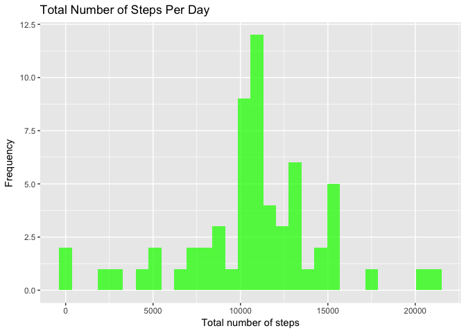

# Reproducible Research: Peer Assessment 1
Shavak Sinanan  

## Introduction

Contained in this report are the items of data analysis as detailed in the instructions for Peer Assessment 1 of *Reproducible Research*.

It is now possible to collect a large amount of data about personal movement using activity monitoring devices such as a [Fitbit](http://www.fitbit.com), [Nike Fuelband](http://www.nike.com/us/en_us/c/nikeplus-fuelband), or [Jawbone Up](https://jawbone.com/up). These type of devices are part of the "quantified self" movement -- a group of enthusiasts who take measurements about themselves regularly to improve their health, to find patterns in their behavior, or because they are tech geeks. But these data remain under-utilised both because the raw data are hard to obtain and there is a lack of statistical methods and software for processing and interpreting the data.

This assignment makes use of data from a personal activity monitoring device. This device collects data at 5 minute intervals through out the day. The data consists of two months of data from an anonymous individual collected during the months of October and November, 2012 and include the number of steps taken in 5 minute intervals each day.

## Data

The data for this assignment can be downloaded from the course web
site:

* Dataset: [Activity monitoring data](https://d396qusza40orc.cloudfront.net/repdata%2Fdata%2Factivity.zip) [52K]

The variables included in this dataset are:

+ **steps** : Number of steps taking in a 5-minute interval (missing
    values are coded as `NA`)

+ **date**: The date on which the measurement was taken in YYYY-MM-DD
    format

+ **interval**: Identifier for the 5-minute interval in which
    measurement was taken

The dataset is stored in a comma-separated-value (CSV) file and there are a total of 17,568 observations in this dataset.

## Required packages

The following packages are used in the analysis: *dplyr*, *ggplot2*, *data.table*.


## Loading and preprocessing the data

The file *activity.csv* should exist in the working directory.


```r
activity <- read.csv("activity.csv", colClasses = c("integer", "Date", "integer")) # date is in YYYY-MM-DD format
```

## What is mean total number of steps taken per day?

The total number of steps taken per day is computed as follows:


```r
activity_by_day <- summarise(group_by(activity, date), total_steps = sum(steps, na.rm = TRUE))
```

Below is a code chunk producing a histogram of the total number of steps per day; the histogram follows.


```r
qplot(date,
      data = activity_by_day,
      geom = "histogram",
      weight = total_steps,
      binwidth = 1,
      main = "Total Number of Steps Per Day",
      xlab = "Date",
      ylab = "Total number of steps",
      fill = I("orange"),
      alpha = I(0.75))
```

 

The mean and median of the total number of steps per day is computed as follows:


```r
mean_steps <- mean(activity_by_day$total_steps)
median_steps <- median(activity_by_day$total_steps)
```

The mean total number of steps is 9354.23.

The median total number of steps is 10395.

## What is the average daily activity pattern?

Below is a code chunk producing a plot of the average number of steps over all of the days for each interval; the plot follows.


```r
activity_by_interval <- summarise(group_by(activity, interval), avg_steps = mean(steps, na.rm = TRUE))
qplot(interval,
      avg_steps,
      data = activity_by_interval,
      geom = "line",
      main = "Average Daily Activity",
      xlab = "Interval",
      ylab = "Average number of steps",
      col = I("red"))
```

 

```r
# I'd really have liked the x axis to be prettier; will work on this more if I have some time
```

Finding the interval with contains the maximum average number of steps:


```r
max_interval <- activity_by_interval[which.max(activity_by_interval$avg_steps), 1]
```

On average over all of the days, the interval 835 contains the maximum number of steps.

## Imputing missing values

Finding the number of rows which contain ``NA`` values:


```r
bad_num <- sum(!complete.cases(activity))
```

There are ``2304`` rows in the dataset containing ``NA`` values.

These missing values shall be replaced with the **average for the corresponding interval over all the days**.

Here is a short function which accepts a dataframe containing data for one day (288 intervals) and replaces the missing values in the `steps` variable of the dataframe with the corresponding values in the `step_profile` argument.


```r
# the following is an impute function designed specifically for "daily" subsets of the master dataset

impute_steps <- function(daily_activity, step_profile = rep(0, 288)) {
    # default is to replace missing values with 0
    baddies <- is.na(daily_activity$steps)
    daily_activity$steps[baddies] <- step_profile[baddies] # replace missing values and keep the rest
    daily_activity
}
```

The values are imputed and a new dataset is constructed as follows:


```r
# split, apply, combine
# do it all in one line - no farting around
patched_activity <- rbindlist(lapply(split(activity, activity$date), impute_steps, step_profile = activity_by_interval$avg_steps)) # replace missing values with average for the appropriate interval
```

Take a look:


```r
head(patched_activity)
```

```
##        steps       date interval
## 1: 1.7169811 2012-10-01        0
## 2: 0.3396226 2012-10-01        5
## 3: 0.1320755 2012-10-01       10
## 4: 0.1509434 2012-10-01       15
## 5: 0.0754717 2012-10-01       20
## 6: 2.0943396 2012-10-01       25
```

The computations of the first section will now be repeated with the new dataset.

The total number of steps taken per day is computed as follows:


```r
patched_activity_by_day <- summarise(group_by(patched_activity, date), total_steps = sum(steps, na.rm = TRUE))
```

Below is a code chunk producing a histogram of the total number of steps per day; the histogram follows.


```r
qplot(date,
      data = patched_activity_by_day,
      geom = "histogram",
      weight = total_steps,
      binwidth = 1,
      main = "Total Number of Steps Per Day",
      xlab = "Date",
      ylab = "Total number of steps",
      fill = I("green"),
      alpha = I(0.75))
```

 

The mean and median of the total number of steps per day is computed as follows:


```r
patched_mean_steps <- mean(patched_activity_by_day$total_steps)
patched_median_steps <- median(patched_activity_by_day$total_steps)
```

The mean total number of steps is 10766.19.

The median total number of steps is 10766.19.

Both the mean and median have **increased** after imputing missing values.

## Are there differences in activity patterns between weekdays and weekends?
